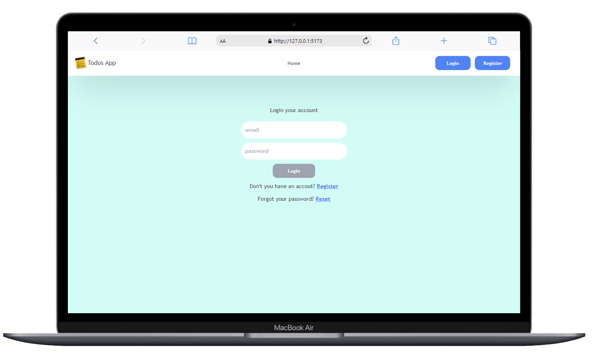
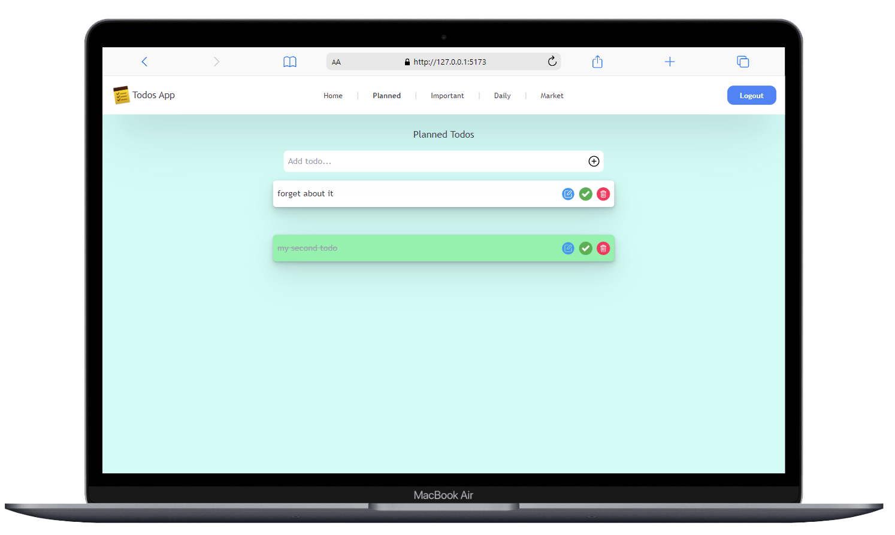
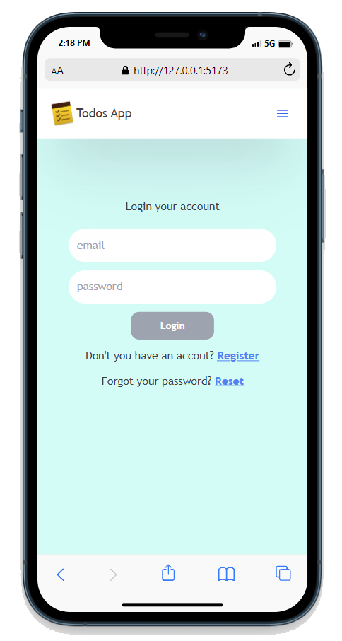
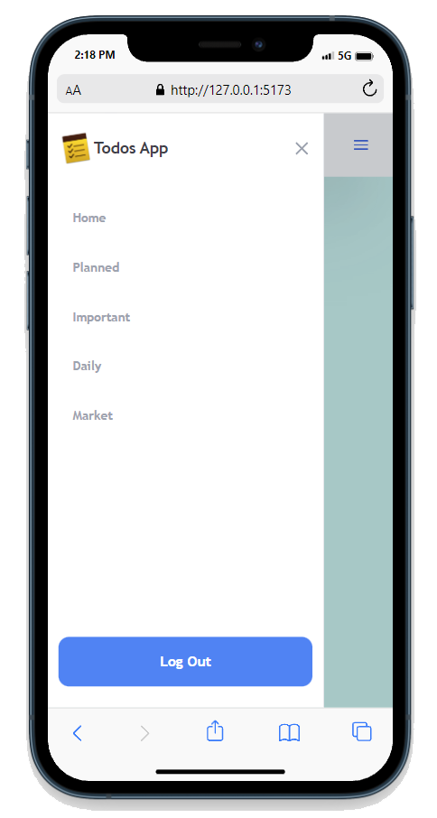
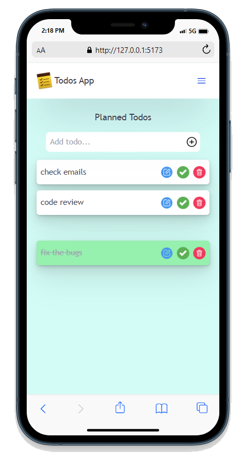
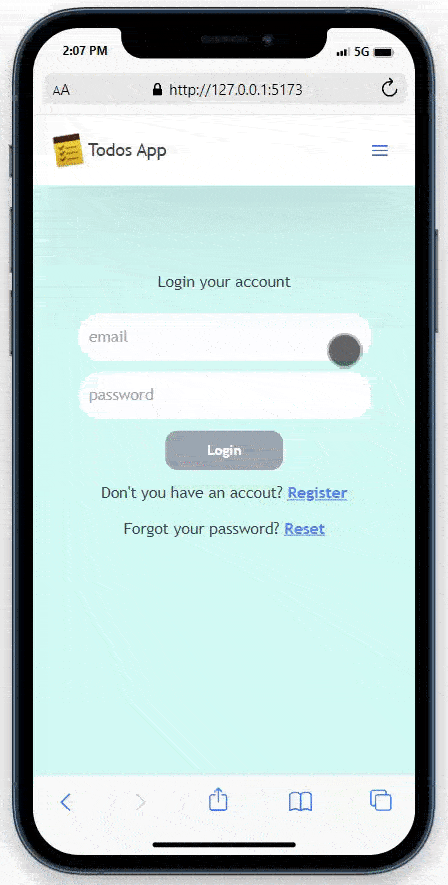

# Todos Application

## Project Description

This is a live time todos application. You can add, edit and delete your todos.

## Live Demo

[](https://app.netlify.com/sites/alihan-todoapp/deploys)

<a href="https://alihan-todoapp.netlify.app/">Live Demo Link</a>


## Table of Contents

- [Project Description](#Project-Description)
- [Live Demo](#Live-Demo)
- [Technologies](#Technologies)
- [Usage](#Usage)
- [Project Setup](#Project-Setup)
  - [Recommended IDE Setup](#Recommended-IDE-Setup)
    - [Installing Dependencies](#Installing-Dependencies)
    - [Compile and Hot-Reload for Development](#compile-and-hot-reload-for-development)
    - [Compile and Minify for Production](#compile-and-minify-for-production)

## Technologies

- Vite, Vuejs 3 Composition API,
- VueRouter,
- Pinia,
- Firebase,
- Tailwind,
- SCSS

## Usage

1. Create a new account from the register page
1. After you logged in, you can use the todo pages to add todos.
1. Write your todo, press the add button, or press the "Enter" key.
1. For editing your todos, click on the todo text field, then write your new todo, and finally press the "Enter" key or "Save" button on the todo text field which is the blue one.

- If you forget your password, you can reset your password from the reset page.

<div align="center">
  
  
</div>
<div align="center" class="bg-blue-500">
  
  
  
  
</div>

## Project Setup

### Recommended IDE Setup

[VSCode](https://code.visualstudio.com/) + [Volar](https://marketplace.visualstudio.com/items?itemName=Vue.volar) (and disable Vetur) + [TypeScript Vue Plugin (Volar)](https://marketplace.visualstudio.com/items?itemName=Vue.vscode-typescript-vue-plugin).

#### Installing Dependencies

```sh
npm install
```

#### Compile and Hot-Reload for Development

```sh
npm run dev
```

#### Compile and Minify for Production

```sh
npm run build
```
